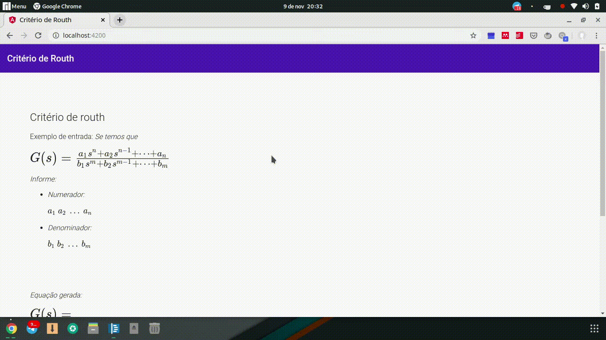

# Routh

O software desse repositório verifica se um sistema **G(s)** dado por uma função de transferência, é estável, assim como verifica algumas de suas características. Para tal, é utilizado o critério de estabilidade de Routh[1].

## Demonstração



<br>

### Para executar

**Observação:** É necessário uma instalação do [Octave](https://www.gnu.org/software/octave/) em um ambiente GNU/Linux para que o sistema funcione corretamente, pois toda a arquitetura foi elaborada sob tais requisitos.

Execute os comandos abaixo para:

* Instalar as dependências do backend:

```bash
$ cd backend
$ yarn install
```

ou caso não utilize o ```yarn```, substitua o segundo comando por:

```bash
$ npm install
```
* Executar o backend:

```bash
$ yarn start
```

ou

```bash
$ npm run start
```
* Instalar as dependências do frontend:

```bash
$ cd frontend/routh-ng
$ yarn install
```

ou caso não utilize o ```yarn```, substitua o segundo comando por:

```bash
$ npm install
```
* Executar o frontend:

```bash
$ ng serve
```

o software será executado no endereço ```localhost:4200```

### Autores:

* [André M. S. Neves](https://github.com/AndreNeves97);
* [Leonam Teixeira de Vasconcelos](https://github.com/leonamtv).

### Referência

* [1] Ogata, Katsuhiko. Engenharia de controle moderno / Katsuhiko Ogata; tradutora Heloísa Coimbra de Souza; revisor técnico Eduardo Aoun Tannuri. -- 5. ed. -- São Paulo : Pearson Prentice Hall, 2010.
